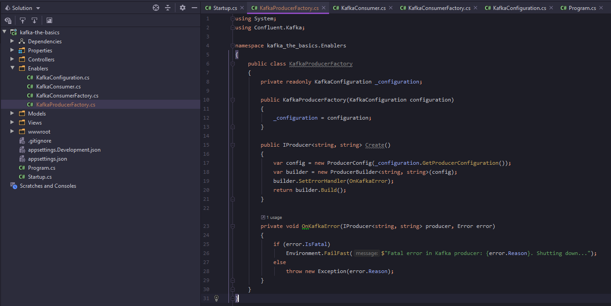

## Kafka in code

Now, it is time to Produce a message to a Topic from our .NET Core project.

Just like the previous kata, where we create a *KafkaConsumerFactory*, we will also be needing a *KafkaProducerFactory*. They're almost identical code wise.

```c#
using System;
using Confluent.Kafka;

namespace kafka_deep_dive.Enablers
{
    public class KafkaProducerFactory
    {
        private readonly KafkaConfiguration _configuration;

        public KafkaProducerFactory(KafkaConfiguration configuration)
        {
            _configuration = configuration;
        }

        public IProducer<string, string> Create()
        {
            var config = new ProducerConfig(_configuration.GetProducerConfiguration());
            var builder = new ProducerBuilder<string, string>(config);
            builder.SetErrorHandler(OnKafkaError);
            return builder.Build();
        }
        
        private void OnKafkaError(IProducer<string, string> producer, Error error)
        {
            if (error.IsFatal)
                Environment.FailFast($"Fatal error in Kafka producer: {error.Reason}. Shutting down...");
            else
                throw new Exception(error.Reason);
        }
    }
}
```



Great. With that in place, it's time to create a KafkaProducer Class, which just like our  *KafkaConsumer* Class, will serve as a service.

```c#
using System;
using System.Threading;
using System.Threading.Tasks;
using Confluent.Kafka;
using Microsoft.Extensions.Hosting;

namespace kafka_deep_dive.Enablers
{
    public class KafkaProducer : BackgroundService
    {
        private readonly KafkaProducerFactory _producerFactory;

        public KafkaProducer(KafkaProducerFactory producerFactory)
        {
            _producerFactory = producerFactory;
        }

        protected override async Task ExecuteAsync(CancellationToken stoppingToken)
        {
            Console.WriteLine("KafkaProducer started.");

            while (!stoppingToken.IsCancellationRequested)
            {
                try
                {
                    await DoWork(stoppingToken);
                }
                catch (Exception err)
                {
                    Console.WriteLine($"Error processing and/or publishing messages to Kafka.");
                }

                await Task.Delay(TimeSpan.FromSeconds(6), stoppingToken);
            }
        }

        private async Task DoWork(CancellationToken stoppingToken)
        {
            const string topic = "build.workshop.something";
            using (var producer = _producerFactory.Create())
            {
                await producer.ProduceAsync(topic: topic, message: new Message<string, string>()
                {
                    Key = Guid.NewGuid().ToString(),
                    Value = $"kafka-deep-dive is running. This message ID is {Guid.NewGuid().ToString()}"
                });
            }
        }
    }
}
``` 

Just like *KafkaConsumer*, we also have a operation loop in *KafkaProducer*. This loop executes just about every sixth second, **Producing** a message to our **Topic**.

Like previously when we have added new Classes that utlize dependency injection, we will have to add them in "Startup.cs", so let us do that.

```c#
public void ConfigureServices(IServiceCollection services)
{
    services.AddControllersWithViews();

    services.AddTransient<KafkaConfiguration>();
    services.AddTransient<KafkaConsumerFactory>();
    services.AddTransient<KafkaProducerFactory>();
    services.AddHostedService<KafkaConsumer>();
    services.AddHostedService<KafkaProducer>();
}
```


Let us try and see it in action.

Go to "dojo/workshops/kafka-deep-dive/3" in a terminal emulator, and execute the following:

`docker-compose up --build`

If the output of the above command didn't fail(if it did, ask for help), in a separate terminal emulator, execute the following:

`docker run -it --rm --network=development edenhill/kafkacat:1.5.0 -C -b kafka:9092 -t build.workshop.something`

Now, ensure you can see both terminal emulators. 

If everything is working as expected, you should after the first window is finished building the project, after a couple of seconds begin to messages being received in both the first window and in the second window where we have a separate Consumer.


---
Great! We now have a .NET Core project that can **Consume** from a **Topic** and **Produce** to a **Topic**.

Next up in the fourth kata, we will take a look at differentiating between messages, by using the schema format we went over in the presentation.
